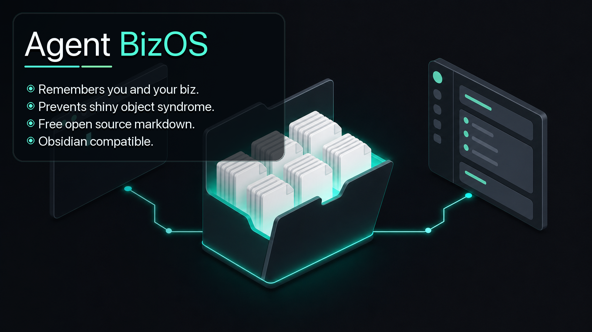

# BizOS: Getting Started



BizOS is a file-based operating system for planning, research, and roadmapping initiatives. It lives as a folder on your computer, opens in Obsidian for browsing and editing, and pairs with an AI agent in the terminal so the agent can read, write, and update the same files you do.

The agent contract lives in `AGENTS.md`, the open standard that AI coding agents read to learn how to behave in a project. Because BizOS speaks that standard, it works with OpenCode, Codex, Claude Code, Cowork, and more. This guide installs OpenCode first because it is open source and free to start, but any AGENTS.md-compatible agent runs the same way.

This guide gets a new user from zero to a working vault in about 20 minutes.

---

## What you're installing

Three pieces working together:

1. **Obsidian** — a free desktop app that treats a folder of Markdown files as a "vault." This is how humans read and edit the system.
2. **An AGENTS.md agent** — a terminal-based AI agent that reads the `AGENTS.md` contract. This guide uses OpenCode, an open-source, provider-agnostic coding agent. This is how you talk to the system, ingest captures, and assign research. OpenCode, Codex, Claude Code, and Cowork all work here.
3. **Terminal** — the command-line app already on your computer. You'll use it to navigate to the vault folder and launch the agent from there.

The vault folder itself is just files on disk. No database, no cloud account, no lock-in. If you want to back it up, copy the folder. If you want to share it across machines, sync the folder.

---

## Step 1: Install Obsidian

**Mac:** Download from [obsidian.md](https://obsidian.md) and drag the app into your Applications folder.

**Windows:** Download the installer from [obsidian.md](https://obsidian.md) and run it.

Open Obsidian once to make sure it launches. Close it. You'll point it at the vault folder in Step 4.

---

## Step 2: Get the BizOS starter files

You should have received the BizOS starter as a folder (zipped, shared drive, or a git repo). Put it somewhere stable on your machine. A reasonable home:

- **Mac:** `~/Documents/BizOS` or `~/projects/BizOS`
- **Windows:** `C:\Users\<you>\Documents\BizOS`

Pick one and remember the path. You'll use it in the next two steps.

### Downloading from GitHub (if you're new to GitHub)

If the starter was shared as a GitHub link (something like `https://github.com/<owner>/<repo>`), you don't need a GitHub account or any git tooling to grab the files. Walk through this once and it'll feel obvious next time.

1. Open the GitHub repository link in your web browser.
2. Look for the green **`<> Code`** button near the top right of the file list. Click it.
3. A small menu appears. At the bottom of the **Local** tab, click **Download ZIP**.
4. Your browser saves a file named something like `<repo>-main.zip` to your Downloads folder.
5. Unzip it:
   - **Mac:** double-click the `.zip` file. A folder appears next to it.
   - **Windows:** right-click the `.zip` file, choose **Extract All...**, then click **Extract**.
6. The unzipped folder will have a name like `<repo>-main`. Rename it to `BizOS` (or whatever you prefer), then move it to the stable home you picked above.

That's it. The folder you just moved is your vault.

> **Heads up:** a ZIP download is a one-time snapshot. If the starter gets updated later, you'd download a fresh ZIP and merge changes by hand. If you expect to pull updates over time, ask whoever shared the repo about cloning it with git instead — but the ZIP path is plenty for getting started.

The starter ships with these files already in place:

- `README.md` — this file
- `AGENTS.md` — the contract any AI agent reads when working in the vault
- `CLAUDE.md` — Claude-specific notes that import `AGENTS.md`
- `MISSION.md` — your operator narrative spine (you'll edit this)
- `ROADMAP.md` — what's in motion right now
- `operator-profile.md` — who the operator or team is
- `00-INBOX/` — where raw captures land before triage
- `30-PROPOSALS/` — where decisions get debated and closed
- `999-ARCHIVE/` — where finished or stale work goes

---

## Step 3: Install an agent (OpenCode)

OpenCode is a command-line tool. You'll install it through your terminal.

**Open the terminal:**
- **Mac:** press `Cmd+Space`, type `Terminal`, press return.
- **Windows:** open PowerShell from the Start menu.

**Install OpenCode.** The install script is the fastest path on Mac and Linux:

```
curl -fsSL https://opencode.ai/install | bash
```

If you already have Node.js (v18 or higher), you can install through npm instead:

```
npm install -g opencode-ai
```

When that finishes, verify it works:

```
opencode --version
```

On first run, OpenCode asks you to connect an AI provider. Run `opencode auth login` and follow the prompts to add a key for the provider you want to use.

> **Prefer a different agent?** BizOS follows the `AGENTS.md` standard, so it also runs with Codex, Claude Code, Cowork, and other AGENTS.md-compatible agents. Install whichever one you already use, then pick up at Step 4. The rest of this guide uses OpenCode as the example, but the workflow is identical: launch the agent inside the vault folder and it reads `AGENTS.md` on startup.

---

## Step 4: Open the vault in Obsidian

Open Obsidian. On the welcome screen, click **"Open folder as vault."** Navigate to your BizOS folder from Step 2 and select it.

Obsidian will index the files and show the folder tree on the left. Click `README.md` to see this file rendered. Click `ROADMAP.md` to see the current state.

That's the human view of the system.

---

## Step 5: Open the agent in the vault folder

Back in the terminal, navigate to the vault folder. The command is `cd` (change directory) followed by the path:

**Mac example:**
```
cd ~/Documents/BizOS
```

**Windows example:**
```
cd C:\Users\<you>\Documents\BizOS
```

Verify you're in the right place by listing the files:

```
ls
```

You should see `README.md`, `AGENTS.md`, `MISSION.md`, and the rest. If you do, launch OpenCode:

```
opencode
```

The agent starts up inside the vault folder. From here on, every conversation it has, every file it reads, every edit it makes happens against this folder.

---

## Step 6: Your first session

When the agent starts in a BizOS vault, the first thing it does is run the **Start-of-Session Ritual** defined in `AGENTS.md`. It reads the operator profile, the mission, the roadmap, scans open proposals, then restates the current focus and asks if you're pivoting.

Try it. Type:

```
what's on the roadmap?
```

The agent reads `ROADMAP.md` and prints the current `Now / Active / Queue` back to you.

Or capture a new idea:

```
I want to add a new initiative around partner integrations. Drop a note in the inbox.
```

Claude writes a fragment into `00-INBOX/`. Later, when you say `triage inbox`, Claude reads everything new, proposes destinations, and (with your approval) files it.

---

## How the daily loop works

Every working session, in roughly this order:

1. **Open the agent in the vault.** It reads README, operator-profile, MISSION, ROADMAP, scans proposals, restates the Now.
2. **Capture anything new.** Tell the agent what's on your mind. It writes to `00-INBOX/`.
3. **Work the current Now.** One thing at a time. The roadmap enforces single-focus discipline.
4. **Triage the inbox** when it gets full (usually weekly). The agent clusters and proposes moves; you approve.
5. **Open proposals for real decisions.** Anything with tradeoffs gets a file in `30-PROPOSALS/` with a `decide-by` date. Past-due proposals get parked by default.
6. **Update ROADMAP.md** as work ships. Items move from Active to Recently Shipped.

The system is the loop. The files are just where the loop stores state.

---

## Customizing for your team

Three files you should edit first to make BizOS yours:

1. **`operator-profile.md`** — who you are, what you do, who you serve, what you're optimizing for. This frames every conversation the agent has with the vault. Without it, you get generic agent behavior.
2. **`MISSION.md`** — the narrative spine. Where you are today, where you're trying to get to, the principles guiding the work.
3. **`ROADMAP.md`** — what's in motion right now. The starter ships with placeholder structure. Replace it with your real current focus.

`AGENTS.md` is the rulebook for how AI agents behave in your vault (voice rules, hard rules, trigger phrases). Edit this as your team's working style evolves.

---

## Workflow trigger phrases

These phrases tell the agent to run a specific workflow. They're defined in `AGENTS.md`. Customize or extend them as your team finds patterns worth naming.

| Phrase | What the agent does |
|---|---|
| `triage inbox` | Reads everything new in `00-INBOX/`, proposes destinations, executes moves on approval. |
| `what's on the roadmap` | Prints the current Now / Active / Queue from `ROADMAP.md`. |
| `open a proposal on X` | Creates a file in `30-PROPOSALS/` with frontmatter and a `decide-by` date. |
| `anything worth saving before I clear?` | Scans the session for durable facts and proposes vault entries before you `/clear`. |

---

## Backup and sync

The vault is a plain folder. Use whatever backup or sync your organization already uses:

- **Single-machine:** Time Machine, File History, or any backup tool.
- **Multi-machine:** Syncthing, Dropbox, OneDrive, iCloud, or a self-hosted sync server.
- **Team-shared:** a shared network folder, a private git repository, or a sync service.

Git is a reasonable choice if you want version history and collaboration through pull requests. It's not required.

---

## Where to get help

- **Obsidian docs:** [help.obsidian.md](https://help.obsidian.md)
- **OpenCode docs:** [opencode.ai/docs](https://opencode.ai/docs)
- **Claude Code docs:** [docs.claude.com/claude-code](https://docs.claude.com/claude-code)
- **The vault itself:** ask your agent. "How does the triage workflow work?" "What's in AGENTS.md?" The agent reads the files and answers from them.

If the system feels stale or you're not sure what to work on, ask your agent: *is the roadmap current?* Trust the files over recall.

---

*BizOS isn't a folder structure. It's a loading order, a forcing function, and a vocabulary. The files just hold the state.*
